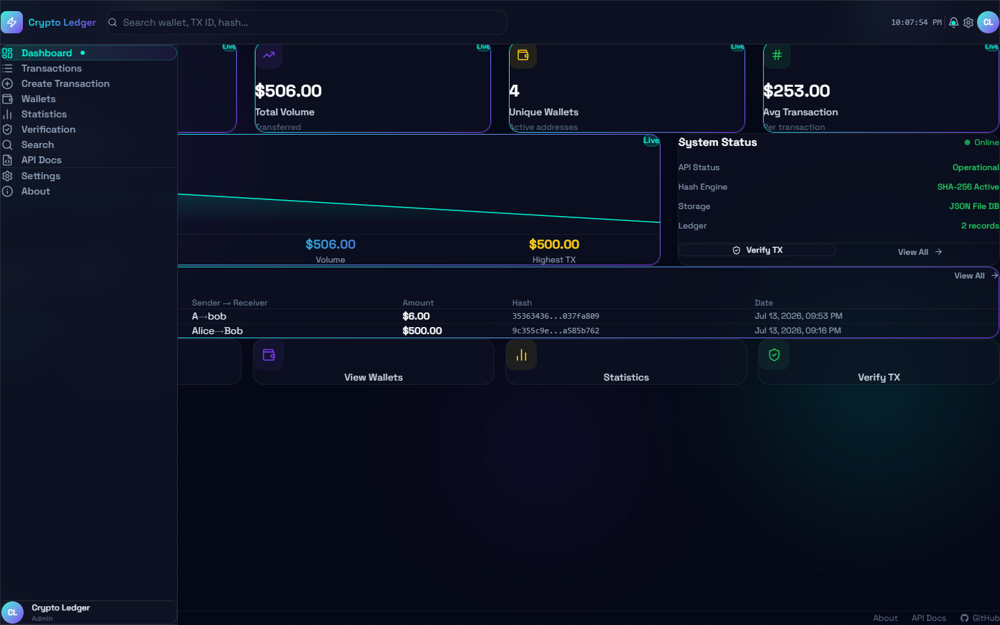
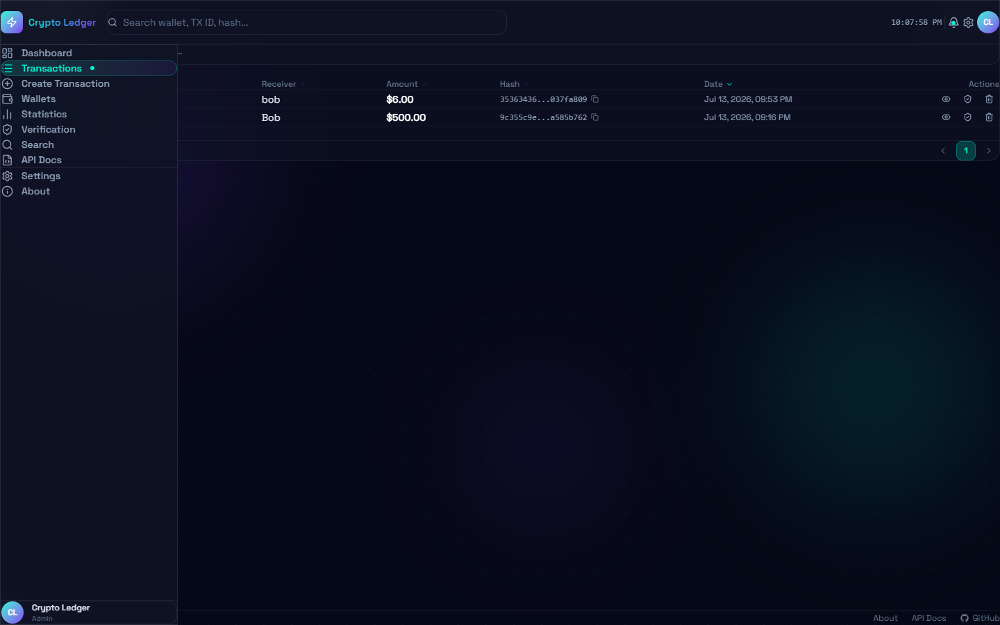
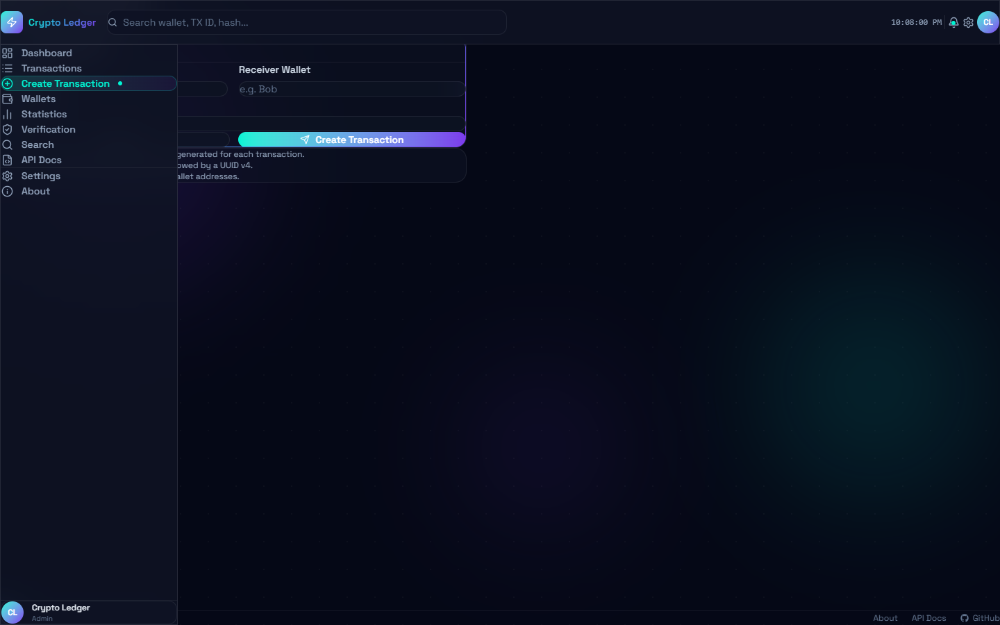
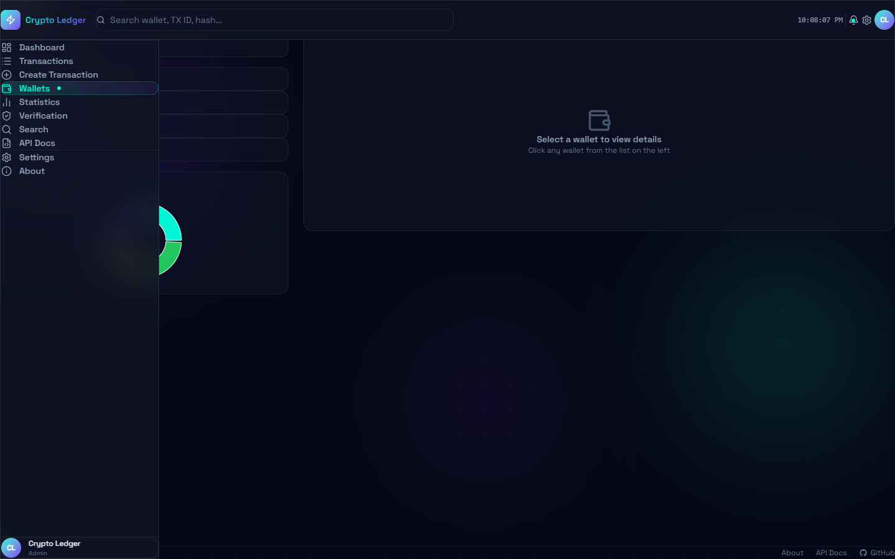
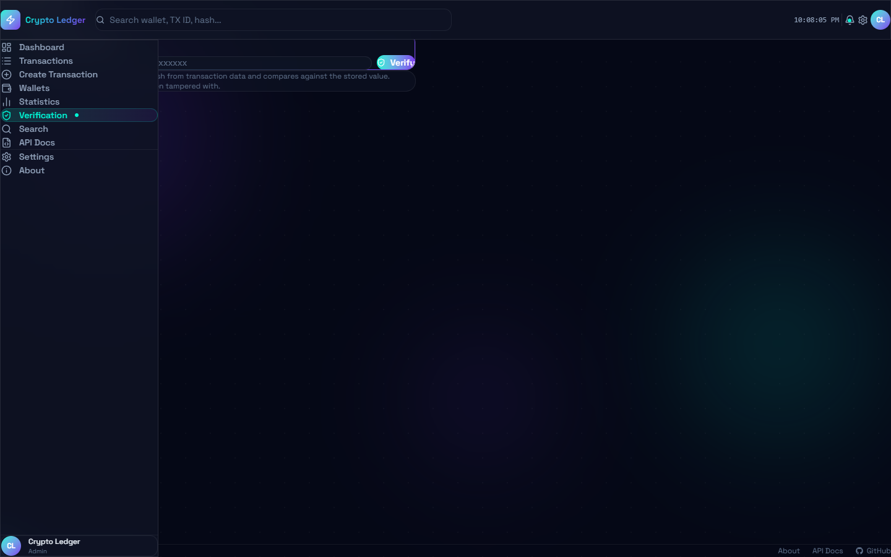

<h1 align="center">
  
</h1>

<p align="center">
  A premium crypto transaction ledger with a glassmorphism UI, SHA-256 integrity verification, real-time analytics, and a full REST API — built as a full-stack monorepo.
</p>

<p align="center">
  
  
  
  
  
  
</p>

---

## Screenshots

### Dashboard


### Transactions


### Create Transaction


### Wallets


### Verification


### Statistics


---

## Features

- **Transaction Ledger** — Create, view, and delete transactions with a full audit trail
- **SHA-256 Integrity Verification** — Every transaction carries a tamper-evident hash; verify any TX ID on demand
- **Wallet Analytics** — Per-address balance tracking derived from all sent/received transactions
- **Live Statistics** — Volume charts, peer-to-peer flow maps, daily breakdowns, and aggregate KPIs
- **Global Search** — Search across TX IDs, wallet addresses, amounts, and hashes in real time
- **QR Code Export** — Each transaction detail page generates a scannable QR code
- **Glassmorphism UI** — Deep navy (`#050816`) background with teal/purple accents, backdrop-blur cards, and animated ambient blobs
- **Animated Page Transitions** — Framer Motion `AnimatePresence` with staggered children on every route
- **Responsive Layout** — Mobile-first sidebar drawer + desktop fixed sidebar, fluid grid system
- **JSON File Database** — Zero-config persistence; no database server required
- **Built-in API Docs** — Interactive endpoint reference at `/api-docs`

---

## Tech Stack

### Backend
| Package | Version | Role |
|---|---|---|
| Node.js | 18+ | Runtime |
| Express | 4 | HTTP framework |
| cors | ^2 | Cross-origin resource sharing |
| morgan | ^1 | Request logging |
| uuid | ^9 | Transaction ID generation |
| dotenv | ^16 | Environment configuration |

### Frontend
| Package | Version | Role |
|---|---|---|
| React | 19 | UI library |
| Vite | 8 | Build tool + dev server |
| Tailwind CSS | v4 (`@tailwindcss/vite`) | Utility-first styling |
| Framer Motion | ^11 | Page transitions + micro-animations |
| TanStack Query | v5 | Server state, caching, mutations |
| React Router DOM | v6 | Client-side routing |
| Axios | ^1 | HTTP client |
| Recharts | ^2 | Area, Bar, Pie, and Line charts |
| React Hook Form | ^7 | Form state management |
| Zod | ^3 | Schema validation |
| qrcode.react | ^3 | QR code generation |
| lucide-react | ^0.4 | Icon set |
| clsx | ^2 | Conditional classnames |

---

## Project Structure

```
blackchain/
├── backend/
│   ├── config/
│   │   └── constants.js          # PORT, file paths
│   ├── controllers/
│   │   └── transactionController.js
│   ├── data/
│   │   └── transactions.json     # Flat-file database
│   ├── middleware/
│   │   ├── errorHandler.js
│   │   └── validation.js
│   ├── models/
│   │   └── transactionModel.js
│   ├── routes/
│   │   └── transactionRoutes.js
│   ├── services/
│   │   └── transactionService.js
│   ├── utils/
│   │   ├── balanceCalculator.js
│   │   ├── hashGenerator.js      # SHA-256 hash builder
│   │   └── idGenerator.js
│   ├── .env
│   ├── package.json
│   └── server.js
│
├── frontend/
│   ├── public/
│   ├── src/
│   │   ├── components/
│   │   │   ├── layout/
│   │   │   │   ├── Footer.jsx
│   │   │   │   ├── Layout.jsx
│   │   │   │   ├── Navbar.jsx
│   │   │   │   └── Sidebar.jsx
│   │   │   └── ui/
│   │   │       ├── AnimatedBackground.jsx
│   │   │       ├── AnimatedCounter.jsx
│   │   │       ├── Badge.jsx
│   │   │       ├── Button.jsx
│   │   │       ├── GlassCard.jsx
│   │   │       ├── Input.jsx
│   │   │       ├── PageTransition.jsx
│   │   │       ├── Skeleton.jsx
│   │   │       └── Tooltip.jsx
│   │   ├── context/
│   │   │   └── AppContext.jsx
│   │   ├── hooks/
│   │   │   └── useTransactions.js  # All TanStack Query hooks
│   │   ├── pages/
│   │   │   ├── About.jsx
│   │   │   ├── ApiDocs.jsx
│   │   │   ├── CreateTransaction.jsx
│   │   │   ├── Dashboard.jsx
│   │   │   ├── NotFound.jsx
│   │   │   ├── SearchPage.jsx
│   │   │   ├── Settings.jsx
│   │   │   ├── Statistics.jsx
│   │   │   ├── TransactionDetails.jsx
│   │   │   ├── Transactions.jsx
│   │   │   ├── Verification.jsx
│   │   │   └── Wallets.jsx
│   │   ├── services/
│   │   │   └── api.js              # Axios instance + named API clients
│   │   ├── App.jsx
│   │   ├── index.css
│   │   └── main.jsx
│   ├── index.html
│   ├── package.json
│   └── vite.config.js
│
├── package.json                    # Monorepo root — concurrently scripts
└── README.md
```

---

## API Reference

Base URL: `http://localhost:3000`

### Transactions

| Method | Endpoint | Description |
|---|---|---|
| `GET` | `/transactions` | List all transactions (sorted newest first) |
| `POST` | `/transactions` | Create a new transaction |
| `GET` | `/transactions/:id` | Get a single transaction by ID |
| `DELETE` | `/transactions/:id` | Delete a transaction |
| `GET` | `/transactions/:id/verify` | Verify SHA-256 hash integrity |
| `GET` | `/transactions/export` | Export all transactions as JSON download |

### Wallets

| Method | Endpoint | Description |
|---|---|---|
| `GET` | `/wallet/:address` | Get balance + transaction history for an address |

### Analytics

| Method | Endpoint | Description |
|---|---|---|
| `GET` | `/stats` | Aggregate statistics (total volume, count, averages, top wallets) |
| `GET` | `/search?q=<query>` | Full-text search across all transaction fields |

### Example — Create Transaction

```bash
curl -X POST http://localhost:3000/transactions \
  -H "Content-Type: application/json" \
  -d '{"sender": "Alice", "receiver": "Bob", "amount": 500}'
```

**Response**
```json
{
  "id": "TX-0d12c453-00bd-46b2-9baa-58c5ad94495a",
  "sender": "Alice",
  "receiver": "Bob",
  "amount": 500,
  "timestamp": "2026-07-13T16:16:41.970Z",
  "hash": "9c355c9eb640dded2d73e4b5bd140441a9f63f0740d49ca624cb8d36a585b762"
}
```

### Example — Verify Transaction

```bash
curl http://localhost:3000/transactions/TX-0d12c453-00bd-46b2-9baa-58c5ad94495a/verify
```

**Response**
```json
{
  "valid": true,
  "storedHash": "9c355c9e...",
  "computedHash": "9c355c9e..."
}
```

---

## Getting Started

### Prerequisites

- Node.js 18 or higher
- npm 9 or higher

### Installation

```bash
# Clone the repository
git clone https://github.com/haseebzahid9/blackchain.git
cd blackchain

# Install dependencies for both backend and frontend
npm run install:all
```

### Running in Development

```bash
# Start both servers simultaneously from the monorepo root
npm run dev
```

This starts:
- **API server** → `http://localhost:3000` (Express + JSON file DB)
- **Web app** → `http://localhost:5173` (Vite dev server with HMR)

The frontend proxies all `/api/*` requests to the backend automatically — no CORS configuration needed on the client.

### Building for Production

```bash
npm run build
```

Output is placed in `frontend/dist/`.

---

## Environment Variables

Create `backend/.env`:

```env
PORT=3000
```

---

## How SHA-256 Verification Works

Each transaction hash is computed at creation time from the transaction's core fields:

```
SHA-256( id + sender + receiver + amount + timestamp )
```

The hash is stored alongside the record in `transactions.json`. The `/verify` endpoint recomputes the hash from the stored fields and compares it byte-for-byte to the stored value. Any mismatch means the record was modified after creation.

---

## Pages

| Route | Page | Description |
|---|---|---|
| `/` | Dashboard | KPI tiles, volume chart, recent transactions, system status |
| `/transactions` | Transactions | Paginated table with sort, filter, copy hash, delete |
| `/transactions/:id` | Transaction Details | Full field breakdown, hash visualizer, QR code |
| `/create` | Create Transaction | Validated form with live transfer preview |
| `/wallets` | Wallets | Wallet list, balance chart, per-address history |
| `/statistics` | Statistics | 8 KPI tiles + 4 detailed Recharts visualizations |
| `/verify` | Verification | Paste any TX ID to verify hash integrity |
| `/search` | Search | Live full-text search across all fields |
| `/api-docs` | API Docs | Built-in REST API reference |
| `/settings` | Settings | App preferences |
| `/about` | About | Project info |

---

## License

MIT License

Copyright (c) 2026 Haseeb Zahid

Permission is hereby granted, free of charge, to any person obtaining a copy
of this software and associated documentation files (the "Software"), to deal
in the Software without restriction, including without limitation the rights
to use, copy, modify, merge, publish, distribute, sublicense, and/or sell
copies of the Software, and to permit persons to whom the Software is
furnished to do so, subject to the following conditions:

The above copyright notice and this permission notice shall be included in all
copies or substantial portions of the Software.

THE SOFTWARE IS PROVIDED "AS IS", WITHOUT WARRANTY OF ANY KIND, EXPRESS OR
IMPLIED, INCLUDING BUT NOT LIMITED TO THE WARRANTIES OF MERCHANTABILITY,
FITNESS FOR A PARTICULAR PURPOSE AND NONINFRINGEMENT. IN NO EVENT SHALL THE
AUTHORS OR COPYRIGHT HOLDERS BE LIABLE FOR ANY CLAIM, DAMAGES OR OTHER
LIABILITY, WHETHER IN AN ACTION OF CONTRACT, TORT OR OTHERWISE, ARISING FROM,
OUT OF OR IN CONNECTION WITH THE SOFTWARE OR THE USE OR OTHER DEALINGS IN THE
SOFTWARE.

---

<p align="center">
  Made by <a href="https://github.com/haseebzahid9">@haseebzahid9</a>
</p>
# crypto-transaction-ledger

